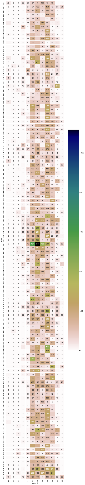

# IMD-grid-data-work
Some work on IMD Pune's gridded data sets  
Author: Nikhil VJ, https://nikhilvj.co.in  

Source URL: https://imdpune.gov.in/Clim_Pred_LRF_New/Grided_Data_Download.html | Alternate: https://imdpune.gov.in/lrfindex.php -> See under Gridded data in side menu.  

Intentions of this project: To make this data more accessible for people, to show much simpler code to extract the data than what I've seen online. And to get my hands dirty on a large trove of Indian open data :)


## Website
- See https://server.nikhilvj.co.in/imd_data/ -> Has the code in imd_data_api/ folder deployed.
- You can select a location and year, and download data as a simple flat CSV (table) file.


## Direct data extract from .GRD files
Note: All code is in python  
Install [imdlib](https://pypi.org/project/imdlib/) package  
Assuming that you've downloaded 2010 data file, saved it as "2010.grd" in "rain" folder next to the program :  
```
import imdlib
rain1 = imdlib.open_data('rain', 2010, 2010, 'yearwise').get_xarray().to_dataframe()
rain2 = rain1[rain1['rain'] > -100].reset_index()
rain2.to_csv('rain_2010.csv',index=False)
```

The functions `.get_xarray()`, `.to_dataframe()` and `.reset_index()` do the job of converting the multi-dimensional dataset into a flat table that can be saved to CSV, excel, etc.

Tip: Do this in Jupyter Notebook, do just till .get_xarray() and then print the variable directly in a cell. It's beautiful.

More extended tutorial in the author's blog: https://saswatanandi.github.io/softwares/imdlib/

## Database loading program : imd_grid_import
- A script (2 actually) to fetch the gridded data downloads from IMD, process it and load into a local dockerized PostGreSQL DB. See the Readme in the imd_grid_import/ folder for more details.

## Database structure explainer
- Update: Separate temperature data tables made; same structure, but with just temperature data which is smaller and will be faster to query. 
- Even after removing all junk data, there's a v.large number of datapoints per yr - around 1.18 Million. Granularity: per date and location.
- Loading each of these into DB takes more time, occupies huge space and even fetching them takes v.long
- Nature of fetching data: Most likely we'll never be fetching just one date's data (like: 2020-01-14) at a time. More likely we'll be fetching for a whole month at a go at least, but for an individual location.
- So, it makes sense to group the data by : Year + month + Location, and store the grouped data in a JSON column.
- Sample data in DB for Grid location (28.5,72.5) , Jan 2020:
```
{"2020-01-01": {"rain": 0.0, "tmax": 17.580678939819336, "tmin": 3.262223720550537},
 "2020-01-02": {"rain": 0.0, "tmax": 20.557445526123047, "tmin": 6.12726354598999},
 "2020-01-03": {"rain": 0.0, "tmax": 21.97892951965332, "tmin": 7.391693115234375},
 "2020-01-04": {"rain": 0.0, "tmax": 22.463241577148438, "tmin": 7.331312656402588},
 "2020-01-05": {"rain": 0.0, "tmax": 22.185802459716797, "tmin": 7.799867630004883},
 "2020-01-06": {"rain": 0.0, "tmax": 19.416574478149414, "tmin": 10.629579544067383},
 "2020-01-07": {"rain": 0.0, "tmax": 18.216487884521484, "tmin": 10.342350959777832},
 "2020-01-08": {"rain": 0.2756316661834717, "tmax": 17.91546058654785, "tmin": 9.598325729370117},
 "2020-01-09": {"rain": 0.0, "tmax": 18.36847496032715, "tmin": 4.737661838531494},
 "2020-01-10": {"rain": 0.0, "tmax": 19.597763061523438, "tmin": 3.922478437423706},
 "2020-01-11": {"rain": 0.0, "tmax": 21.578903198242188, "tmin": 6.793002605438232},
 "2020-01-12": {"rain": 0.0, "tmax": 23.62282943725586, "tmin": 8.204022407531738},
 "2020-01-13": {"rain": 7.230362892150879, "tmax": 17.89722442626953, "tmin": 11.31865119934082},
 "2020-01-14": {"rain": 0.5124186873435974, "tmax": 17.625137329101562, "tmin": 5.582608222961426},
 "2020-01-15": {"rain": 0.0, "tmax": 17.577001571655273, "tmin": 4.793914794921875},
 "2020-01-16": {"rain": 0.0, "tmax": 16.759170532226562, "tmin": 6.7936177253723145},
 "2020-01-17": {"rain": 0.0, "tmax": 19.58401870727539, "tmin": 5.236929416656494},
 "2020-01-18": {"rain": 0.0, "tmax": 19.54751205444336, "tmin": 5.679737567901611},
 "2020-01-19": {"rain": 0.0, "tmax": 18.521821975708008, "tmin": 5.7684712409973145},
 "2020-01-20": {"rain": 0.0, "tmax": 19.22909164428711, "tmin": 6.524430751800537},
 "2020-01-21": {"rain": 0.0, "tmax": 21.767934799194336, "tmin": 8.751236915588379},
 "2020-01-22": {"rain": 0.0, "tmax": 21.532318115234375, "tmin": 8.174297332763672},
 "2020-01-23": {"rain": 0.0, "tmax": 21.776113510131836, "tmin": 7.345406532287598},
 "2020-01-24": {"rain": 0.0, "tmax": 22.189123153686523, "tmin": 6.468899250030518},
 "2020-01-25": {"rain": 0.0, "tmax": 24.130014419555664, "tmin": 6.97148323059082},
 "2020-01-26": {"rain": 0.0, "tmax": 25.91004180908203, "tmin": 7.372500896453857},
 "2020-01-27": {"rain": 0.0, "tmax": 23.614274978637695, "tmin": 11.573892593383789},
 "2020-01-28": {"rain": 7.257974147796631, "tmax": 19.39422607421875, "tmin": 11.302903175354004},
 "2020-01-29": {"rain": 0.0, "tmax": 21.57762336730957, "tmin": 6.99928092956543},
 "2020-01-30": {"rain": 0.0, "tmax": 21.596620559692383, "tmin": 7.587302207946777},
 "2020-01-31": {"rain": 0.0, "tmax": 21.153125762939453, "tmin": 6.719666004180908}}
 ```
 - With one line, this dict can be turned into a flat pandas dataframe table in python:  
 `df = pd.DataFrame(data).transpose().reset_index().rename(columns={'index':'date'})`
- Like this, the number of rows in DB for one year reduces from 1.81M to around 60k : reduction to around 3% or by 30x.
- This results in a lot faster speed in retrieving the data from DB, doing geospatial queries etc.
- The entire IMD gridded dataset is in DB in 7,247,891 (~7.2M) rows.

Note: tmax and tmin were available at lower grid resolution than rainfall data, so in the DB table imd_data there will be locations that only have rainfall data.

### Update: separate temperature tables added
`imd_temp_data` and `temp_grid` tables contain data and grid locations respectively of just the temperature records. They're much smaller in quantity than the rain records, so use these if you only want temperature data.

## Downloaded data checksums
- See [sha256_checksum_rain.txt](sha256_checksum_rain.txt), [sha256_checksum_tmax.txt](sha256_checksum_tmax.txt), [sha256_checksum_tmin.txt](sha256_checksum_tmin.txt) files in this repo to see the checksums of the downloaded .grd data from IMD site. 
- This can be used to cross-check data authenticity / detect if there have been changes in the data published in the website after July 2022 when I had downloaded them.
- It's good practice for the publishing site to publish these checksums next to their data, to give end users a way to ensure there's been no file corruption or middle-player manipulation. Recommending IMD site to do this.

## Sample notebooks
Check out the .ipynb Jupyter notebooks (python3 programs) here showing sample code to work with the data in Database once you have it ready.

## Sample viz
For location [18.5,74.0 nr Pune, India](https://www.openstreetmap.org/#map=11/18.5/74/0), cumulative monthly rainfall from 1901 to 2021:



See [2022-07-14 rainfal viz 1.ipynb](https://github.com/answerquest/IMD-grid-data-work/blob/main/2022-07-14%20rainfal%20viz%201.ipynb) for the code that made this.
